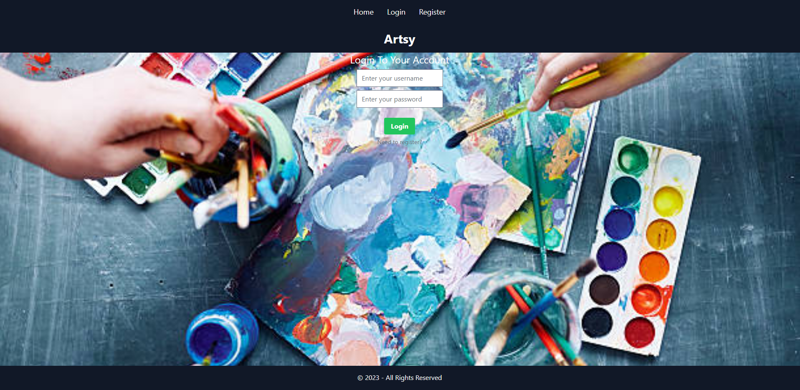

# Artsy

## Table of Contents

- [Description](#description)
- [Installation](#installation)
- [Mock-Up](#mock-up)
- [Usage](#usage)
- [License](#license)
- [Badges](#badges)

## Description

Artsy is a class that is designed for beginners or experienced artist who just want to have some fun and create some art. It’s a website where you can sign up for a art class to expand and learn new skills and more!

# User Story

```
AS A user
I WANT to be able to sign up for a class
SO THAT I can learn new art skills.
```

# Acceptance Criteria

```
GIVEN an art application
WHEN I load the application,
THEN I am presented with a navbar with login, home, and register tabs.
WHEN I click on register tab
THEN I am given a sign up form to create a new account.
WHEN I click on login tab
THEN I am given a login form to login to my account.
WHEN I click on home tab
THEN I am given a list of classes to choose from.
WHEN I click on a class
THEN I am given a description of the class and a button to sign up for the class.
WHEN I click on the sign up button
THEN I am given a form to fill out to sign up for the class.
WHEN I click on the submit button
THEN I am given a confirmation message that I have signed up for the class.
WHEN I click on the logout button
THEN I am logged out of my account.

```

## Installation

GitHub Repo: https://github.com/JoeBosz/artsy

Deployment:
Heroku: https://artsy-smartsy.herokuapp.com/
Netlify: https://deploy-preview-38--spiffy-frangipane-f2ca92.netlify.app/

## Mock-Up

The following image shows the web application's appearance and functionality:




## Usage

Click link in top right corner of page to add notes. Once your notes are added and saved, you will be able to view them on the side of the page along with other saved notes.

## License


MIT License

Copyright (c) 2023 Brittany Burton, Anthony Dandino, John Robinson, and Joseph Stzembosz

Permission is hereby granted, free of charge, to any person obtaining a copy of this software and associated documentation files (the "Software"), to deal in the Software without restriction, including without limitation the rights to use, copy, modify, merge, publish, distribute, sublicense, and/or sell copies of the Software, and to permit persons to whom the Software is furnished to do so, subject to the following conditions:

The above copyright notice and this permission notice shall be included in all copies or substantial portions of the Software.

THE SOFTWARE IS PROVIDED "AS IS", WITHOUT WARRANTY OF ANY KIND, EXPRESS OR IMPLIED, INCLUDING BUT NOT LIMITED TO THE WARRANTIES OF MERCHANTABILITY, FITNESS FOR A PARTICULAR PURPOSE AND NONINFRINGEMENT. IN NO EVENT SHALL THE AUTHORS OR COPYRIGHT HOLDERS BE LIABLE FOR ANY CLAIM, DAMAGES OR OTHER LIABILITY, WHETHER IN AN ACTION OF CONTRACT, TORT OR OTHERWISE, ARISING FROM, OUT OF OR IN CONNECTION WITH THE SOFTWARE OR THE USE OR OTHER DEALINGS IN THE SOFTWARE.

## Badges

    [](https://github.com/prettier/prettier) [](code_of_conduct.md)
